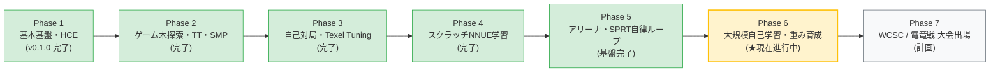

# TabulaShogi Architecture & Design Guide

本書では、TabulaShogiの内部設計、モジュール構造、アルゴリズムの詳細、および将来の機能拡張方針について解説します。

---

## 1. モジュール分離と依存関係

```text
src/
├── main.rs          # USIループ起動用エントリポイント
├── lib.rs           # 各モジュールの公開と統合
├── types/           # 将棋の基礎型定義
│   ├── color.rs     # 先手・後手 (Black / White)
│   ├── piece.rs     # 駒種 (生駒, 成駒, 持ち駒, SFEN)
│   ├── square.rs    # 9x9マス (0..81, USI変換)
│   └── moves.rs     # 指し手 (通常移動, 駒打ち, 成り)
├── board/           # 盤面状態と履歴
│   ├── position.rs  # 盤面配列, 持ち駒, do/undo_move, 利き計算
│   └── zobrist.rs   # XorShift64による決定論的Zobrist Hash
├── book/            # 純粋な内蔵定跡
│   └── tree.rs      # 手書き定跡木（最大26手・探索時間0秒で着手）
├── movegen/         # 合法手生成
│   └── generator.rs # 移動手, 駒打ち手, 二歩/行き所なし除外, 打ち歩詰め判定
├── eval/            # スクラッチ評価関数
│   ├── evaluator.rs # 駒得, PST, 玉の囲い度, 手番ボーナス, 浮き駒ペナルティ
│   ├── nnue.rs      # 完全スクラッチNNUE推論 & 16bit整数量子化シリアライザ
│   └── trainer.rs   # スクラッチNNUEバックプロパゲーション & Adamオプティマイザ
├── search/          # ゲーム木探索
│   ├── engine.rs    # Negamax + Alpha-Beta, 反復深化, 静止探索, Null Move Pruning
│   ├── tt.rs        # 置換表 (Transposition Table)
│   ├── ordering.rs  # Move Ordering (TT, MVV-LVA, Killer, Countermove, History)
│   ├── see.rs       # 静的交換探索 (Static Exchange Evaluation)
│   ├── dfpn.rs      # df-pnアルゴリズムによる超高速詰将棋探索
│   └── time_mgr.rs  # 時間配分管理 (持ち時間, 秒読み)
├── selfplay/        # 完全自律型自己対局パイプライン
│   ├── config.rs    # 自己対局設定 (探索深さ, 乱数序盤手, スレッド数, 投了閾値)
│   ├── game.rs      # 1局の対局シミュレーション (詰み, 千日手, 最大手数)
│   ├── manager.rs   # マルチスレッド並行対局制御 & リアルタイム統計
│   ├── csa.rs       # 標準CSA形式 (Version 2.2) 棋譜シリアライザ
│   └── dataset.rs   # 機械学習用局面データセット記録 (SFEN, 評価値, 結果)
├── tune/            # スクラッチ強化学習・評価パラメータ自己最適化
│   ├── params.rs    # PST & 駒価値のパラメータベクトル表現
│   └── texel.rs     # Texel Tuning (Adamオプティマイザ / Elo勝率モデル)
├── arena/           # エンジン対局・SPRT検定・自律進化ループ
│   ├── match_runner.rs # 先後交代ペアマッチ並列実行 & 勝率・Elo差測定
│   ├── sprt.rs         # Waldの逐次確率比検定 (LLR)
│   └── loop_pipeline.rs# 自己対局 ➜ 学習 ➜ 検定 ➜ 昇格の完全自律ループ
└── usi/             # プロトコル通信層
    ├── parse.rs     # USIコマンドパース
    └── protocol.rs  # Lazy SMP並列探索スレッド制御, 入出力ループ
```

---

## 2. 盤面表現と利き計算

### 座標系

- 将棋盤は 9×9 = 81マス。
- 内部表現: `Square(0..=80)`
  - `file` (筋): 0 (1筋) 〜 8 (9筋)
  - `rank` (段): 0 (1段目/a) 〜 8 (9段目/i)
  - `index = file * 9 + rank`
- この設計により、同一筋上の連続アクセスや段ごとのオフセット計算が整数の乗加算で高速に行われます。

### 利き計算 (`attacks_to`)

- 飛び駒（香車、飛車、竜、角、馬）はレイスキャン方式を採用。
- 近接駒（歩、桂、銀、金、成駒、玉）はオフセットテーブルによる定数時間参照。
- 自玉の王手判定は、玉の位置に対して相手側の利きが存在するかを走査することで、極めて軽量に判定します。

---

## 3. 合法手生成の完全性

1. **疑似合法手の生成**:
   - 盤上の駒の利き先（味方の駒があるマスは除外）。
   - 持ち駒の空マスへの打込み（二歩チェック、行き所のないマスへの打込みチェック）。
   - 成りの強制チェック（1段目の歩・香、1〜2段目の桂）と任意成りの分岐。
2. **厳密な合法手フィルタリング**:
   - 候補手を実際に `pos.do_move()` して自玉が王手されていないか（自殺手・王手放置）を検証。
   - **打ち歩詰め（反則）の検出**:
     - 歩を打って王手になった場合、相手玉に逃げ手（回避可能な合法手）が1手でも存在するかをチェック。
     - 逃げ手が存在しない（即詰み）の場合は打ち歩詰めとして候補から除外。

---

## 4. 評価関数の設計 (スクラッチ数理モデル)

外部の学習済みモデルやOSSの重みを一切使わない、完全スクラッチのデュアル評価機構（HCE / NNUE）です。

### 4.1 手動評価関数 (Hand-Crafted Evaluation: HCE)

$$Score = (Material_{Black} - Material_{White}) + (PST_{Black} - PST_{White}) + (Safety_{Black} - Safety_{White}) + Tempo$$

1. **駒得 (Material)**:
   - 各駒の基礎価値 + 持ち駒ボーナス（盤上より自由度が高いため +15% 程度の加算）。
2. **Piece-Square Tables (PST)**:
   - 序盤での重要マス（7六、2六等の角道・飛先歩、中央の位取り）へのボーナス。
   - 玉の囲い位置（8八、2八等）への加点と、居玉（5九）放置への減点。
3. **玉の安全度 (King Safety)**:
   - 自玉の周囲8マスに存在する守備駒（金・銀・成駒）の枚数と連携度を評価。
4. **手番ボーナス (Tempo Bonus)**:
   - 手番側の主導権ボーナス (+25 cp) を付与。

### 4.2 スクラッチ NNUE 評価ネットワーク (Phase 4)

- **入力層**: 1,386 次元スパース特徴量（81マス × 14駒種 + 持ち駒7種 × 2色 × 18枚上限）
- **隠れ層**: 128 ニューロン、活性化関数 ClippedReLU（$0.0 \le x \le 1.0$、推論時は整数 $0 \le x \le 127$）
- **視点アキュムレータ**: 先手・後手双方の視点から特徴量をインクリメンタル加算
- **出力層**: 256 入力（先手128 + 後手128）から 1 スコアを出力、センチポーンスケール変換
- **ゼロ依存バックプロパゲーション**: Rust 標準ライブラリのみによる連鎖律微分およびスパース Adam オプティマイザ
- **16-bit 量子化バイナリ形式 (`TABU_NN1`)**: ヘッダー（8バイトマジック + 入出力次元）+ 16bit整数重み（合計 355,604 bytes）

---

## 5. 探索アルゴリズム

### 反復深化 (Iterative Deepening)

- 深さ1から開始し、深さを1ずつ上げながら最善手と評価値を更新。
- 設定された目標時間（Time Manager）に達した段階で深さ探索を打ち切り、確実に時間内に最善手を返答。

### 静止探索 (Quiescence Search)

- 深さ0の葉ノードにおいて、駒の取り合いや成り手のみを再帰探索。
- 地平線効果（大駒が取られる変化を直前で見失う現象）を防止。

### 置換表 (Transposition Table)

- XorShift64による決定論的Zobrist Hashキーを使用。
- 各ノードの評価値の種類（Exact, LowerBound, UpperBound）を区別して枝刈り。
- PV（Principal Variation）読み筋の復元にも利用。

### Move Ordering

- 置換表の手（TT Move）を最優先。
- MVV-LVA（Most Valuable Victim - Least Valuable Attacker: 捕獲される駒の価値 × 10 - 取る駒の価値）で駒取り手を優先。
- キラー手ヒューリスティックによるベータカット手の優先。

### 並列探索 (Lazy SMP)

- 共有 Atomic 置換表を活用したマルチスレッド並列探索。探索ツリーに自然なジッターを与えて異なる探索領域を開拓。

---

## 6. アリーナ対戦＆SPRT検定（Phase 5）

### 先後交代ペアマッチ（Fair Game Pairing）

- 将棋の先手勝率バイアス（約52〜54%）を完全に中和するため、モデル A とモデル B の対局は、同一のランダム序盤局面から先手・後手を入れ替えたペア（2局1セット）で並列実行されます。

### SPRT (Sequential Probability Ratio Test: 逐次確率比検定)

- Stockfish / Fishtest で採用されている Wald の逐次検定を標準ライブラリのみで数理実装：
  - 帰無仮説 $H_0: \Delta Elo \le 0$（強化されていない）
  - 対立仮説 $H_1: \Delta Elo \ge 5$（有為に強化された）
  - 許容過誤確率: $\alpha = 0.05, \beta = 0.05$
  - 対数尤度比（LLR）が上限境界値 $\ln((1-\beta)/\alpha) \approx 2.94$ を超えた段階で即座に **Pass（モデル昇格）** と判定し、無駄な対局リソースを削減。

### 自律的自己改善ループ (`SelfImprovementLoop`)

- 人間の手動操作を排し、以下の 4 ステップを自律的に繰り返す進化サイクルを実現：
  1. 現行ベストモデルによる自己対局 ➜ データセット蓄積
  2. スクラッチ NNUE バックプロパゲーションによる新世代候補モデルの学習
  3. 新旧世代のアリーナ対局 & SPRT 統計検定
  4. 勝ち越し時の自動昇格（`best_nnue.bin` の更新）および次世代への継続

---

## 7. 開発ロードマップと現在地



### 7.1 フェーズ別マイルストーン詳細

- **Phase 1: 基本基盤（✅ 完了 - v0.1.0 リリース）**:
  - 81マス盤面表現、駒の移動・打込み、王手回避手専用生成器、二歩・打ち歩詰めの厳密判定。
  - USI プロトコル通信ループの実装、初期手動評価関数（HCE）。
  - GitHub Actions によるマルチプラットフォーム自動ビルド＆リリースパイプラインの配備。
- **Phase 2: ゲーム木探索と品質基盤（✅ 完了）**:
  - Negamax + Alpha-Beta 探索、反復深化、静止探索（Quiescence Search）。
  - Atomic ロックフリー 64-bit 置換表（TT）、SEE駒得オーダリング、キラー手・歴史ヒューリスティック。
  - df-pn アルゴリズムによる超高速詰将棋ルーチン、Lazy SMP 並列探索、CI/CD 静的解析整備。
- **Phase 3: 自己対局強化学習パイプライン（✅ 完了）**:
  - スタンドアロン自己対局エンジン（`tabula-shogi selfplay`）。
  - 標準 CSA 形式棋譜（v2.2）および学習用データセット（TSV）の自動生成・蓄積。
  - Texel Tuning（Adam オプティマイザ）による HCE パラメータ自己最適化（`tabula-shogi tune`）。
- **Phase 4: スクラッチ NNUE 学習パイプライン（✅ 完了）**:
  - 外部機械学習ライブラリゼロのスクラッチ NNUE バックプロパゲーション学習器（`tabula-shogi train-nnue`）。
  - 16bit 整数量子化バイナリシリアライザ（`TABU_NN1`、モデルサイズ 355 KB）。
  - USI 動的切り替えオプション（`Eval_Type` / `NNUE_File`）と探索エンジンの統合。
- **Phase 5: 自律的自己改善ループ & レーティング自動検定（✅ 完了）**:
  - 先後交代ペアマッチ並列アリーナ（`tabula-shogi match`）。
  - Wald の逐次確率比検定（SPRT）による統計的モデル昇格・早期打ち切り判定。
  - 自己対局 ➜ データ蓄積 ➜ NNUE 学習 ➜ アリーナ対局 ➜ モデル昇格の完全自動ループ（`tabula-shogi loop`）。
- **Phase 6: 大規模自律自己学習と NNUE 重みの実戦育成（🔥 現在地・進行中）**:
  - 数千〜数万局規模の自律自己対局ループの長時間稼働。
  - スクラッチ NNUE 重みの継続的学習と世代交代によるレーティング向上。
  - HCE に対する有意な勝ち越しと、新旧 NNUE 世代間の勝率検定。
- **Phase 7: 大会出場とさらなる高みへ（🚀 将来目標）**:
  - 世界コンピュータ将棋選手権 (WCSC) / 電竜戦 への出場。
  - LMR（Late Move Reductions）や Singular Extension 等の高度な探索枝刈り拡張。
  - 複数マシンによる分散並列自己対局ワーカーの構築。
