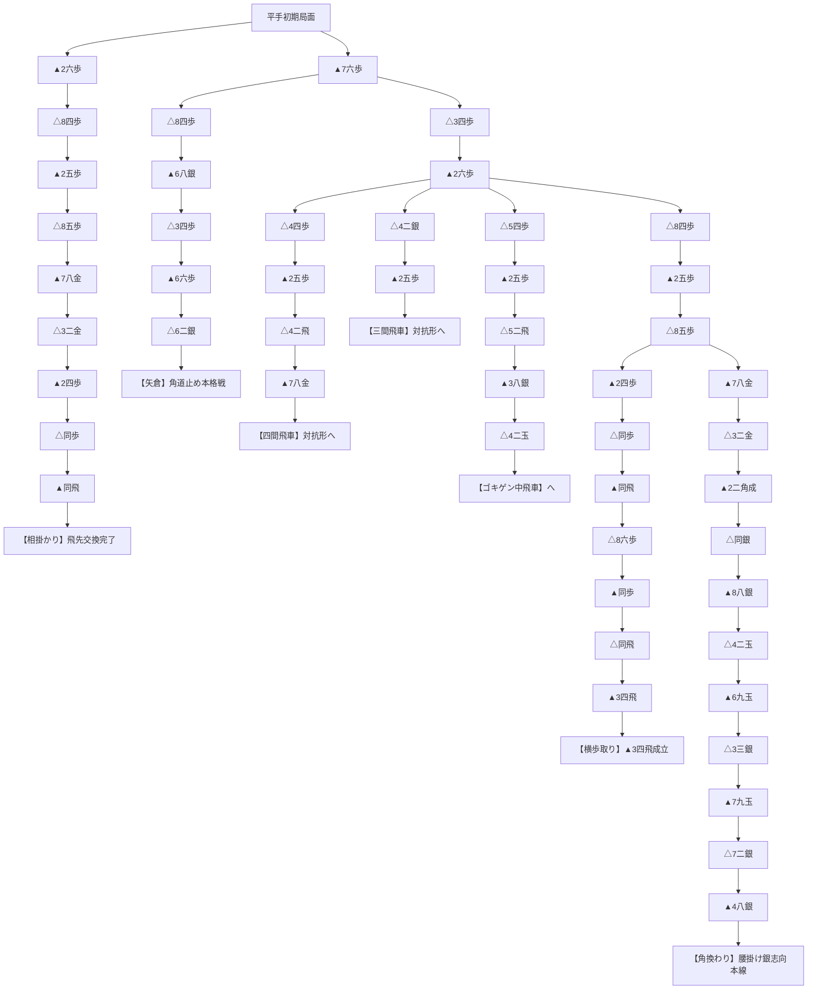

# TabulaShogi 内蔵定跡ツリー解説書（Opening Book）

TabulaShogi（`src/book/tree.rs`）に組み込まれている **内蔵定跡データベース（オープニングブック）** の全分岐と手順を、人間が見やすい将棋の指し手表記（▲・△）とMermaid図でまとめたドキュメントです。

TabulaShogi は、最大 **26手目** までこの定跡ツリーを参照し、合致する局面では **「探索時間ゼロ（0秒）」** で最善手を即座に着手します。

---

## 1. 定跡ツリー全体図（Mermaid）

---

## 2. 登録されている主要戦型と手順解説

### ① 【角換わり】本線（最長20手目前後まで登録）

現代将棋の王道である角換わり手順です。
先手が8手目に角を交換し、お互いに玉を移動させながら金銀を進出させます。

1. ▲7六歩 ➜ 2. △3四歩
2. ▲2六歩 ➜ 4. △8四歩
3. ▲2五歩 ➜ 6. △8五歩
4. ▲7八金 ➜ 8. △3二金
5. **▲2二角成** ➜ 10. **△同銀**（角交換成立）
6. ▲8八銀 ➜ 12. △4二玉
7. ▲6九玉 ➜ 14. △3三銀
8. ▲7九玉 ➜ 16. △7二銀
9. ▲4八銀（腰掛け銀・早繰り銀の分岐点へ）

---

### ② 【相掛かり】本線

初手▲2六歩から始まり、角道を開けずに飛車先の歩を交換し合うスピード感ある縦の戦いです。

1. ▲2六歩 ➜ 2. △8四歩
2. ▲2五歩 ➜ 4. △8五歩
3. ▲7八金 ➜ 6. △3二金
4. **▲2四歩** ➜ 8. **△同歩**
5. **▲同飛**（先手の飛先交換完了）

---

### ③ 【矢倉】角道止め本格戦

後手が△8四歩と突いてきた変化に対して、先手が角道を止めてじっくり組み合う古典的・重厚な戦型です。

1. ▲7六歩 ➜ 2. △8四歩
2. ▲6八銀 ➜ 4. △3四歩
3. **▲6六歩**（角道を止める） ➜ 6. △6二銀

---

### ④ 【横歩取り】激戦型

お互いに角道を開け、飛車先の歩を交換し合った後、先手が横歩をかすめ取る激しい空中戦の定跡です。

1. ▲7六歩 ➜ 2. △3四歩 ➜ 3. ▲2六歩 ➜ 4. △8四歩 ➜ 5. ▲2五歩 ➜ 6. △8五歩
2. ▲2四歩 ➜ 8. △同歩 ➜ 9. ▲同飛
3. △8六歩 ➜ 11. ▲同歩 ➜ 12. △同飛
4. **▲3四飛**（横歩取り成立）

---

### ⑤ 【対抗形】四間飛車・三間飛車・中飛車

相手が振り飛車（後手）を選択した場合の受け止め定跡です。

- **四間飛車**: 4手目 △4四歩 ➜ ▲2五歩 ➜ **△4二飛** ➜ ▲7八金
- **三間飛車**: 4手目 △4二銀 ➜ ▲2五歩
- **ゴキゲン中飛車**: 4手目 △5四歩 ➜ ▲2五歩 ➜ **△5二飛** ➜ ▲3八銀 ➜ △4二玉

---

## 3. 定跡から外れた後の挙動

- **定跡終了条件**:
  1. 相手がツリーにない手を指した瞬間。
  2. 手数が `OPENING_BOOK_MAX_PLY`（26手）を超えた局面。
- **探索への移行**:
  - 定跡ツリーから外れた手番からは、即座に **αβ探索（Iterative Deepening + df-pn）** が引き継ぎ、自力で深く読んで最善手を決定します。
